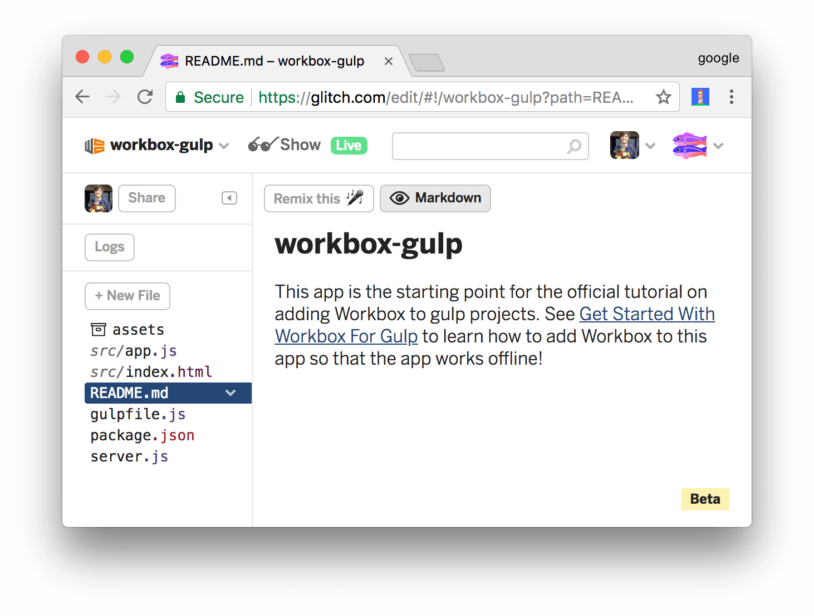

project_path: /web/tools/_project.yaml
book_path: /web/tools/_book.yaml
description: Learn how to make a gulp-based app work offline by adding Workbox to it.

{# wf_updated_on: 2017-11-17 #}
{# wf_published_on: 2017-11-17 #}

# Get Started With Workbox For Gulp {: .page-title }



In this tutorial, you use Workbox to make a simple web app work offline.

If you'd like a conceptual overview of Workbox before starting this tutorial,
see the [Overview](/web/tools/workbox/overview).

## Step 1: Set up your project {: #setup }

The project that you're going to add Workbox to is hosted on [Glitch][Glitch].
First, you need to set up Glitch so that you can edit your own copy of the
project.

[Glitch]: https://glitch.com/about/

1. Open the [demo](https://glitch.com/edit/#!/workbox-gulp).

     <figure>
       
       <figcaption>
         <b>Figure 1</b>. The starting point demo, hosted on Glitch
       </figcaption>
     </figure>

1. Click **workbox-gulp** at the top-left of the page. The **Project
   info and options** dropdown appears.
1. Click **Remix This**. Your browser redirects to an editable copy of
   the project.

<<_shared/try-initial.md>>

## Step 2: Install Workbox {: #install }

Next, you're going to add Workbox to the project to enable an offline
experience.

1. Re-focus the tab that shows you the source code of the project.
1. Click `package.json` to open that file.
1. Click **Add package**.
1. Type `workbox-build` within the **Add Package** text box, then
   click on the matching package to add it to the project.

     <aside class="note">**Note**: This is equivalent to running `npm install
     workbox-build`. In your own projects, you'll probably want to
     save Workbox as a [development dependency][devDependencies] instead by
     running `npm install workbox-build --save-dev`, since
     `workbox-build` is a build-time tool.</aside>

     <figure>
       
       <figcaption>
         <b>Figure 5</b>. Adding the <code>workbox-build</code> package
       </figcaption>
     </figure>

[devDependencies]: https://docs.npmjs.com/files/package.json#devdependencies
   
Every time you make a change to your code, Glitch automatically
re-builds and re-deploys your app. The tab running the live app automatically
refreshes, too.

## Step 3: Add Workbox to your Gulp build process {: #gulp }

Workbox is installed, but you're not using it in your gulp build process, yet.

1. Click `gulpfile.js` to open that file.
1. Import the Workbox plugin. The bold code is the code that you need to add to your project.

    <pre class="prettyprint">var gulp = require('gulp'),
        del = require('del'),
        runSequence = require('run-sequence'),
        <strong>workbox = require('workbox-build');</strong>
    </pre>

1. Add a task to generate your service worker using Workbox.

    <pre class="prettyprint"><strong>gulp.task('generate-service-worker', () => {
      return workbox.generateSW({
        globDirectory: './dist/',
        globPatterns: ['\*\*\/\*.{html,js,css}'],
        swDest: './dist/sw.js',
        clientsClaim: true,
        skipWaiting: true
      }).then(() => {
        console.info('Service worker generation completed.');
      }).catch((error) => {
        console.warn('Service worker generation failed: ' + error);
      });
    });</strong></pre>

1. Call the Workbox task as the last step in your build process.
    
    <pre class="prettyprint">gulp.task('default', function () {
      runSequence('clean', 'build', <strong>'generate-service-worker'</strong>);
    });</pre>

### Optional: How the config works {: #optional-config }

`gulpfile.js` determines how the app is built.

* The `clean` task deletes the output directory.
* The `build` task builds the app. In this case, it just copies the source files to the output
  directory.
* The `generate-service-worker` task creates your service worker code, using Workbox.
* The `default` task is the master task that choreographs all of the sub-tasks.

The object that you pass to `workbox.generateSW()` configures how Workbox runs.

<<_shared/config.md>>

<<_shared/register.md>>

## Step 5: Add runtime caching {: #runtime }

Runtime caching lets you store content that's not under your control
when your app requests it at runtime. For example, by runtime caching the
Hacker News content which this app relies on, you'll be able to provide
an improved offline experience for your users. When users visit the app
while offline, they'll be able to see the content from the last time
that they had an internet connection.

1. Re-focus the tab that shows you the source code of your project.
1. Open `webpack.config.js` again.
1. Add a `runtimeCaching` property to your Workbox configuration.
   `urlPattern` is a regular expression pattern telling Workbox which
   URLs to store locally. `handler` defines the caching strategy that Workbox
   uses for any matching URL. See [The Offline Cookbook][cookbook] for more
   on caching strategies.

    <pre class="prettyprint">new workboxPlugin({
      globDirectory: dist,
      globPatterns: ['**/*.{html,js}'],
      swDest: path.join(dist, 'sw.js'),
      clientsClaim: true,
      skipWaiting: true,
      <strong>runtimeCaching: [
        {
          urlPattern: new RegExp('https://hacker-news\.firebaseio\.com'),
          handler: 'staleWhileRevalidate'
        }
      ]</strong>
    })</pre>

[cookbook]: /web/fundamentals/instant-and-offline/offline-cookbook/

### Try out the complete offline experience {: #try-complete }

The app now provides a complete offline experience. Try it now:

1. Reload the live version of your app.
1. Use the DevTools **Command Menu** to go back offline.
1. Reload the app. The app now displays the content from the last time
   that you were online.

     <figure>
       
       <figcaption>
         <b>Figure 10</b>. The complete offline experience
       </figcaption>
     </figure>

1. Use the DevTools **Command Menu** to go back online.

## Step 6: Create your own service worker {: #inject }

Up until now, you've been letting Workbox generate your entire service
worker. If you've got a big project, or you want to customize how you cache
certain resources, or do custom logic in your service worker, such as add
support for push notifications, which you're going to add in this section,
then you need to create a custom service worker that calls Workbox instead.
Think of the service worker code you write as a template. You write your custom logic with
placeholder keywords that instruct Workbox where to inject its code.

1. Re-focus the tab containing your project source code.
1. Open `package.json`.
1. Click **Add Package**, type `workbox-sw`, then click on the matching package to install
   that library.
1. Write down the version number of `workbox-sw` that gets installed. You'll
   need it later.
1. Add the following line of code to the `init()` function in `app.js`.

    <pre class="prettyprint">function init() {
      let title = document.createElement('h1');
      title.textContent = 'Top 10 Hacker News Stories';
      document.body.appendChild(title);
      let list = document.createElement('ol');
      document.body.appendChild(list);
      fetchTop10().then(stories => renderTop10(stories));
      if ('serviceWorker' in navigator) {
        window.addEventListener('load', () => {
          navigator.serviceWorker.register('/sw.js').then(registration => {
            console.log('SW registered: ', registration);
            <strong>registration.pushManager.subscribe({userVisibleOnly: true});</strong>
          }).catch(registrationError => {
            console.log('SW registration failed: ', registrationError);
          });
        });
      }
    }</pre>

    <aside class="warning">**Warning**: For simplicity, this demo asks for permission to
    send push notifications as soon as the service worker is registered. Best practices
    strongly recommend against out-of-context permission requests like this in real apps.
    See [Permission UX][UX].</aside>

[UX]: /web/fundamentals/push-notifications/permission-ux

1. Click **New File**, enter `src/sw.js`, then press <kbd>Enter</kbd>.
1. Insert the following code into `src/sw.js`.

    <pre class="prettyprint"><strong>// TODO: Replace Xs.
    importScripts('/node_modules/workbox-sw/build/importScripts/workbox-sw.prod.vX.X.X.js');
    
    // Note: Ignore the error that Glitch raises about WorkboxSW being undefined.
    const workbox = new WorkboxSW({
      skipWaiting: true,
      clientsClaim: true
    });
    
    workbox.router.registerRoute(
      new RegExp('^https://hacker-news.firebaseio.com'),
      workbox.strategies.staleWhileRevalidate()
    );
    
    self.addEventListener('push', (event) => {
      const title = 'Get Started With Workbox For Webpack';
      const options = {
        body: event.data.text()
      };
      event.waitUntil(self.registration.showNotification(title, options));
    });

    workbox.precache([]);</strong></pre>

    <aside class="important">**Important**: `workbox.precache([])` is a placeholder keyword.
    At build-time, Workbox injects the list of files to cache into the array.</aside>

1. Replace each `X` in `importScripts('.../workbox-sw.prod.vX.X.X.js')` with
   the version number of `workbox-sw` in `package.json` that you noted earlier.
1. Open `webpack.config.json`.
1. Remove the `runtimeCaching`, `clientsClaim`, and `skipWaiting` properties from your Workbox
   plugin configuration. These are now handled in your service worker code.
1. Add the `swSrc` property to your Workbox plugin configuration in `webpack.config.json`
   to instruct Workbox to inject its code into a custom service worker. 

    <pre class="prettyprint">new workboxPlugin({
      globDirectory: dist,
      globPatterns: ['**/*.{html,js}'],
      <strong>swSrc: './src/sw.js',</strong>
      swDest: path.join(dist, 'sw.js')
    })</pre>

### Try out push notifications {: #try-push }

The app is now all set to handle push notifications. Try it now:

1. Re-focus the tab running the live version of your app.
1. Click **Allow** when Chrome asks you if you want to grant the app
   permission to send push notifications. If you don't see the prompt, make sure you're online
   and then reload the page.
1. Go to back to the **Service Workers** tab in DevTools.
1. Enter some text into the **Push** text box, then click **Push**. Your operating system
   displays a push notification from the app.

     <figure>
       
       <figcaption>
         <b>Figure 11</b>. Simulating a push notification from DevTools
       </figcaption>
     </figure>

    <aside class="note">**Note**: If you don't see the **Push** text box, you're running an older
    version of Chrome. Click the **Push** link instead. DevTools sends a notification with the
    text `Test push message from DevTools`.</aside>

### Optional: How service worker injection works {: #optional-injection }

At the bottom of your custom service worker, you call `workbox.precache([])`. This is a
placeholder. At build-time, the Workbox plugin replaces the empty array with the list
of resources to precache. Your Workbox plugin configuration in `webpack.config.json` still
determines what resources get precached.

## Next steps {: #next-steps }

* Read the [Overview](/web/tools/workbox/overview) to learn more about the benefits that
  Workbox can provide to your project and how Workbox works.
* If you plan on building a custom service worker, it's helpful to understand [the service
  worker lifecycle](/web/fundamentals/primers/service-workers/lifecycle). See [Service Workers:
  An Introduction](/web/fundamentals/primers/service-workers/) to learn the basics of service
  workers.
* If you build projects with Workbox and run into questions or issues, [ask a question on
  Stack Overflow and tag it with `workbox`][SO].

[SO]: https://stackoverflow.com/questions/ask?tags=workbox
